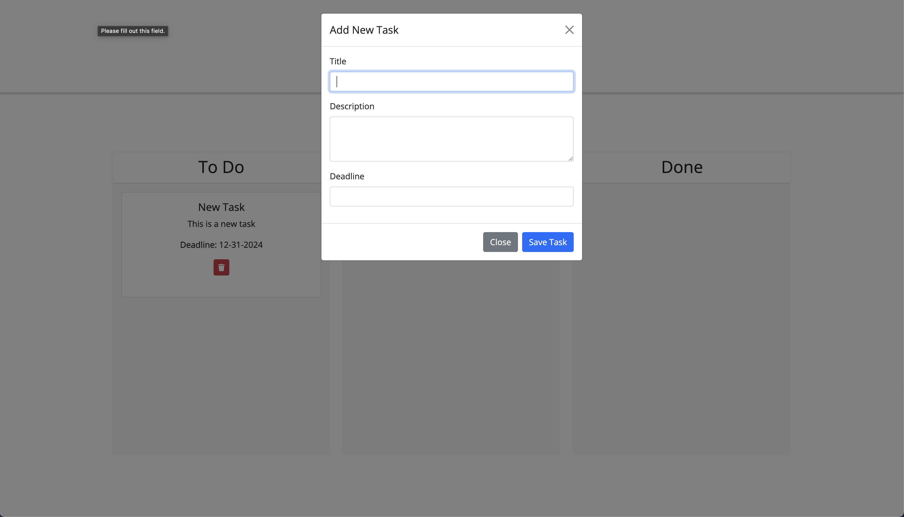

# Task Board

A simple Kanban board for task management built using HTML, CSS, JavaScript, and jQuery. The application allows users to create, manage, and organize tasks in different stages of progress: To Do, In Progress, and Done.

## Table of Contents

1. [Features](#features)
2. [Technologies Used](#technologies-used)
3. [Screenshots](#screenshots)
4. [Live Demo and Repository](#live-demo-and-repository)
5. [Usage Instructions](#usage-instructions)
   - [Installation](#1-installation)
   - [How to Use](#how-to-use)
6. [License](#license)

## Features

- Add Tasks: Users can add tasks by providing a title, description, and deadline.
- Drag-and-Drop: Tasks can be moved between columns to update their progress.
- Deadline Tracking: Tasks are visually styled based on their deadlines:
  - Red: Overdue
  - Yellow: Due Today
- Delete Tasks: Remove tasks easily using a delete button.
- Persistent Storage: Tasks are saved in `localStorage` and persist after refreshing the page.

---

## Technologies Used

- Frontend: HTML, CSS (Bootstrap 5), JavaScript, jQuery, jQuery UI
- Date Handling: Day.js library
- Storage: `localStorage` for task persistence

---

## Screenshots

### Task Board Interface


### Add Task Modal



---

## Live Demo and Repository

- **Live Demo**: [Task Board](https://michaelpratt23.github.io/05-Task-Board/)
- **Repository**: [GitHub Repository](https://github.com/michaelpratt23/05-Task-Board/)

---

## Usage Instructions

### 1. Installation

1. Clone this repository:

   ```bash
   git clone git@github.com:michaelpratt23/05-Task-Board.git

   ```

2. Navigate to the project directory:

   ```bash
   cd task-board

   ```

3. Open the project in your code editor or IDE.

4. Open the `index.html` file in your browser to view the application.

---

## How to Use

1. **Add a Task**:

   - Click the green "Add Task" button.
   - Fill in the title, description, and deadline in the modal form.
   - Click "Save Task" to add it to the **To Do** column.

2. **Move Tasks**:

   - Drag and drop tasks between columns (e.g., **To Do**, **In Progress**, **Done**) to update their status.

3. **Delete a Task**:

   - Click the red trash icon on a task card to delete it.

4. **Track Deadlines**:
   - Tasks due today are highlighted in **yellow**.
   - Overdue tasks are highlighted in **red**.

---

## License

This project is open source and available under the [MIT License](LICENSE).
